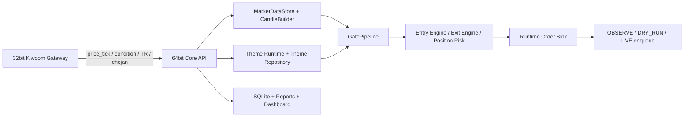
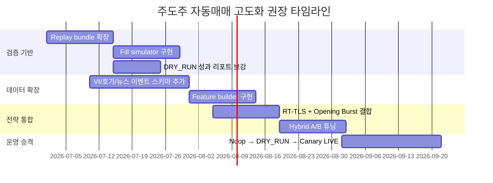

# 한국 국내장 주도주 단기매매 자동매매 개발 심층 보고서

## Executive Summary

본 조사에서 가장 중요한 결론은 두 가지다. 첫째, 국내 주식 단기매매에서 흔히 말하는 “주도주 단기매매”를 자동화하려면 단순 조건검색식보다 **실시간 테마 강도, 테마 내 대장주 역할, 장초 거래대금 버스트, 눌림목 진입 타이밍, 체결 리스크**를 한 덩어리로 다루는 구조가 필요하다. `suseok_ai`는 이미 그 방향으로 설계가 많이 진척돼 있으며, 특히 **Naver 테마 유니버스 동기화**, **Opening Burst**, **Intraday Discovery**, **Theme Core V3**, **Hybrid Dynamic Theme Gate**, **DRY_RUN 성과분석**까지 이어지는 파이프라인이 존재한다는 점에서 “주도주 단기매매 연구용 프레임워크”로는 상당히 적합하다. 다만 현재 기본 운영은 여전히 **OBSERVE/DRY_RUN 중심**이며, 자동 실주문까지 바로 이어지는 구조는 의도적으로 막혀 있다. fileciteturn19file0L7-L13 fileciteturn14file0L108-L129 fileciteturn15file0L45-L75 fileciteturn39file0L176-L209 fileciteturn47file0L23-L32

둘째, 사용자가 원하는 “한국 주식 커뮤니티에서 수익·승률이 좋다고 평가되는 상위 3개 모델”은 **공개적으로 검증 가능한 원문·성과 수치가 매우 제한적**이었다. 그래서 아래 보고서에서는 **직접 검증 가능한 공개 원문**을 우선 사용해, 국내 리테일 담론에서 가장 자주 쓰이는 주도주 단기매매의 세 가지 실전형 모델을 추려 비교했다. 이 중 `suseok_ai`와 구조적으로 가장 잘 맞는 것은 **실시간 주도테마·대장주 선별 + 눌림목 재돌파형**이며, 다음이 **장초 거래대금 버스트형**, 마지막이 **가격·거래량 모멘텀/차트패턴 분류형**이다. 정량 성과의 공개 강도는 세 번째가 가장 높았고, 실제 국내 단타 운용 맥락과의 적합도는 첫 번째와 두 번째가 더 높았다. fileciteturn34file0L5-L18 fileciteturn45file0L62-L76 citeturn22academia7turn29academia1

또 하나의 실무적 결론은, `suseok_ai`에 외부 모델을 바로 대입하면 최소 네 가지 문제가 발생한다는 점이다. **실주문 경로가 막혀 있는 점**, **호가잔량·VI·뉴스 같은 미시구조 피처가 부족한 점**, **리플레이/백테스트가 아직 부분적이라는 점**, **후보 탐색과 실시간 구독 한도가 시장 전체 스캔형 모델에 비해 좁다는 점**이다. 이 네 가지를 해결하지 않으면 백테스트가 좋아 보여도 실제 장중 자동매매에서는 과최적화, 기회손실, 체결왜곡, 운영장애가 한꺼번에 나타날 가능성이 높다. 특히 한국 시장은 소형주일수록 수익률 분포의 꼬리가 두껍고, 가격제한폭 제도 변경 이후 장중 변동성이 더 커졌다는 연구가 있어, **리얼타임 체결현실화**가 중요하다. fileciteturn29file0L160-L175 fileciteturn31file0L143-L164 fileciteturn16file0L22-L40 fileciteturn17file0L12-L18 citeturn27academia2turn21academia7

## 조사 범위와 모델 선정 기준

본 보고서는 사용자가 데이터 기간과 종목군을 지정하지 않았기 때문에, **개발 제안 기준의 기본 가정**을 “최근 3년, KOSPI+KOSDAQ 전체, 장중 규칙 기반 단기매매, 거래비용과 슬리피지 반영”으로 두고 해석했다. 이 가정은 구현 우선순위와 검증 방법을 제안하기 위한 기준이며, 실제 적용 단계에서는 **KOSDAQ 중심**, **거래대금 상위 300~500종목 중심**, 혹은 **테마 유니버스 중심**으로 더 좁혀야 한다. 이 판단은 `suseok_ai` 자체가 기본적으로 **테마 유니버스 + 실시간 거래대금/가격 기반 후보 압축**을 채택하고 있고, Opening Burst도 장초 거래대금 상위 seed를 기준으로 동작하며, RT-TLS 문서 또한 watchset을 상위 테마·상위 종목 중심으로 제한하기 때문이다. fileciteturn24file0L19-L20 fileciteturn45file0L67-L76 fileciteturn34file0L202-L220

`주도주 단기매매` 맥락에서 모델을 고르는 기준은 다음 네 가지로 두는 것이 합리적이다. **국내 리테일 용어와의 일치성**, **자동매매로 규칙화 가능한 정도**, **공개 원문에서 확인 가능한 정량 근거의 강도**, **`suseok_ai` 현재 구조와의 적합성**이다. 이 기준으로 보면 RSI 단독, 이동평균 단독 같은 보편 기술지표 전략보다, **거래대금·테마 확산·대장주 역할·눌림목 위치**를 함께 보는 모델이 훨씬 더 적합하다. 실제 `suseok_ai` 문서도 조건검색식 자체를 핵심 축으로 보지 않고, **실시간 테마 membership, turnover, breadth, leader strength, price location**으로 이동하는 방향을 명시하고 있다. fileciteturn34file0L5-L18 fileciteturn39file0L16-L35

또한 한국 시장의 구조적 특성도 모델 선택에 중요하다. KOSPI 200 내에서도 **대형주 집합이 모멘텀 수익률을 약화시키고**, 일부 서브유니버스가 더 높은 모멘텀 성과를 보였다는 연구가 있으며, 가격 제한폭 변경 이후에는 장중 변동성이 증가했다. 이는 한국 국내장에서 “주도주 단타”가 **시장 전체 무차별 스캔**보다는 **중소형 성장주·테마주·거래대금 상위군**에서 작동할 가능성이 높다는 점을 시사한다. citeturn28view0turn29academia1turn21academia7

## 커뮤니티형 모델 후보 비교

직접 검증 가능한 공개 원문을 기준으로 정리하면, 국내 리테일 주도주 단기매매의 핵심 모델은 아래 세 가지로 압축된다. 표의 첫 두 모델은 공개 성과치가 빈약하지만 **국내 단타 문법과 `suseok_ai` 구현 적합도**가 높고, 세 번째는 **정량 성과 근거가 가장 강한 공개 모델군**이다. 이 세 번째 모델은 “커뮤니티 체감형 주도주 단타”보다는 “가격·거래량 모멘텀의 계량화”에 더 가깝지만, 공개된 한국 시장 성과 자료가 상대적으로 강해 비교군으로 포함했다. fileciteturn34file0L107-L148 fileciteturn45file0L62-L76 citeturn22academia7turn29academia0turn29academia1

| 모델명 | 출처 링크 | 핵심지표 | 백테스트 기간·수익률·승률·최대낙폭 | 장단점 |
|---|---|---|---|---|
| **실시간 주도테마·대장주 + 눌림목 재돌파** | RT-TLS 설계 문서, Hybrid Gate 문서, pipeline 코드 fileciteturn34file0L107-L148 fileciteturn39file0L16-L35 fileciteturn26file0L83-L158 | 거래대금 순위, breadth, 가중 수익률, leader strength, 1·3·5분 momentum, membership score, pullback_from_high_pct, execution_strength, chase_risk fileciteturn34file0L111-L148 fileciteturn39file0L45-L60 | **공개 수익률·승률·MDD 미공개.** 다만 repo는 15분 승률, 리스크율, MFE/MAE, missed-opportunity를 shadow report로 측정하도록 설계돼 있다. fileciteturn39file0L126-L160 | 국내 단타의 “주도테마-대장주-눌림목” 문법과 가장 잘 맞고 `suseok_ai` 구조 적합도가 높다. 반면 공개 백테스트가 없고 현재는 observe-only 기본값이라 즉시 실전 자동화 지표로 쓰기 어렵다. fileciteturn39file0L176-L209 |
| **장초 거래대금 버스트 + 시초가 상위 seed** | Opening Burst, Intraday Discovery, runtime wiring fileciteturn45file0L62-L76 fileciteturn46file0L41-L77 fileciteturn15file0L83-L99 | 09:03·09:06·09:09·09:12·09:15 seed 시각, 거래대금 상위, 등락률, 현재가, 거래량, 장중 phase별 재탐색 버킷, 상위 N·union size 제한 fileciteturn45file0L67-L80 fileciteturn46file0L45-L59 | **공개 수익률·승률·MDD 미공개.** 기본 출력 모드는 `OBSERVE`이며 실시간 seed/후속 discovery를 위한 연구용 파이프라인으로 설계돼 있다. fileciteturn45file0L31-L39 fileciteturn46file0L27-L30 | 장초 강한 종목·테마를 빠르게 포착하는 데 유리하고 한국 단타 커뮤니티의 “장초 거래대금/시초가 매매” 감각과 가깝다. 반면 체결강도 기울기, 호가 잔량, 뉴스 촉매 없이 거래대금 seed만 쓰면 오탐이 많아질 수 있다. fileciteturn45file0L45-L59 fileciteturn20file0L22-L46 |
| **가격·거래량 모멘텀/차트패턴 분류형** | 한국 시장 딥러닝 차트분석 논문, KOSPI 200 모멘텀 연구들 citeturn22academia7turn29academia0turn29academia1 | 과거 가격·거래량 패턴, 차트 윈도, 상대강도/모멘텀 랭킹, 거래비용 반영 성과 비교 citeturn22academia7turn28view0turn29academia0 | 2020–2022 한국 시장에서 차트분석형 딥러닝 모델은 **총수익률 75.36%, Sharpe 1.57**을 기록했다. 별도의 KOSPI 200 연구에서는 2000–2011 기간에 일부 서브유니버스 모멘텀이 더 높은 성과를 보였고, 거래비용을 반영한 implemented return과 Sharpe로 검증했다. 다만 공개 snippet 기준으로 **일관된 승률·MDD 단일 수치까지는 확인되지 않았다.** citeturn22academia7turn28view0turn29academia1 | 공개 정량근거가 가장 강하다. 반면 `주도주 단기매매`의 실시간 테마·대장주 문맥을 직접 반영하지 않으면 해석 가능성이 낮고, 장중 자동주문 로직으로 옮길 때 feature drift 위험이 크다. citeturn22academia7turn29academia0 |

실전 개발 관점에서의 우선순위는 분명하다. **`suseok_ai`에 가장 자연스럽게 이식되는 모델은 첫 번째 모델**이고, 장초 포착 성능을 높이기 위한 보조 축으로 두 번째 모델을 결합하는 방식이 가장 현실적이다. 세 번째 모델은 성과 근거가 강하지만, 현재 `suseok_ai`가 가진 **테마 membership·리더십·entry timing 중심 구조**와는 결이 다르므로, “핵심 레짐 필터”나 “후보 재랭킹 보조모델”로 쓰는 편이 낫다. fileciteturn14file0L83-L105 fileciteturn15file0L147-L239 fileciteturn39file0L16-L27

## suseok_ai 구조와 전략 인터페이스 검토

`suseok_ai`의 현재 아키텍처는 **32비트 Kiwoom Gateway**와 **64비트 Core/API/Web**를 분리한 형태다. Gateway는 Kiwoom OpenAPI+ ActiveX/QAxWidget, 실시간 등록/해제, 조건검색, TR 요청, 주문 요청, chejan 이벤트 같은 브로커 종속 작업만 담당하고, Core는 전략 런타임, 테마 엔진, 리스크 검사, DB, API, 대시보드를 맡는다. Gateway와 Core 간의 기본 통신은 **Gateway→Core `POST /api/gateway/events`**, **Core→Gateway `GET /api/gateway/commands` long-poll** 구조이며, 대시보드용 WebSocket은 이와 분리돼 있다. fileciteturn19file0L7-L13 fileciteturn19file0L95-L105

Kiwoom 연동 자체는 `kiwoom/client.py`가 맡는데, 여기서 `PyQt5.QAxContainer.QAxWidget`을 직접 import하며, 실패 시 “32bit Python이 필요하다”는 런타임 예외를 올린다. 또한 실시간 주가용 FID는 현재가, 등락률, 누적거래량, 누적거래대금, 시가/고가/저가, 체결시간, 최우선 매도/매수호가, 체결강도 중심으로 정의돼 있다. 즉 현재 구조는 **L1 급의 시세와 일부 체결 지표**는 다루지만, **호가잔량 전층, 개별 체결 플로우, 뉴스 촉매, 프로그램 수급, VI 전용 이벤트**까지는 기본 데이터 모델에 들어 있지 않다. fileciteturn20file0L83-L117 fileciteturn20file0L22-L46

Core 쪽 데이터 파이프라인은 `GatewayEventMarketDataBridge`가 `price_tick` 이벤트를 받아 `MarketDataService`로 넣고, 여기서 `MarketDataStore`, `CandleBuilder`, `MarketIndexStore`가 갱신되는 구조다. 같은 이벤트는 `GatewayEventThemeRuntimeBridge`를 통해 `RealTimeThemeRuntime`의 stock snapshot으로도 흘러간다. 즉 한 번의 `price_tick`이 **가격 데이터 저장소**와 **테마 런타임 snapshot**을 동시에 갱신하는 이중 경로를 가진다. fileciteturn43file0L23-L57 fileciteturn43file0L113-L158

Core 런타임 팩토리는 이미 “주도주 단기매매형” 파이프라인을 상당수 내장하고 있다. `build_reboot_v2_runtime_bundle()`는 `CandidateIngestionService`, `CandidateHydrator`, `OpeningThemeBurstRuntimePipeline`, `IntradayDiscoveryRuntimePipeline`, `ThemeCoreV3RuntimePipeline`, `MarketRegimeRuntimePipeline`, `StrategyContextRuntimePipeline`, `EntryEngineRuntimePipeline`, `ExitEngineRuntimePipeline`, `PositionRiskRuntimePipeline`, `OrderManagerRuntimePipeline`를 연결한다. 이 조합은 **장초 후보 생성 → 장중 테마/리더십 갱신 → 시장국면 판단 → 진입/청산/리스크/주문관리** 흐름과 거의 일치한다. fileciteturn15file0L62-L75 fileciteturn15file0L83-L113 fileciteturn15file0L133-L239

전략 인터페이스의 핵심은 `GatePipeline.evaluate()`와 `HybridDynamicThemeGate.evaluate()`다. `GatePipeline`은 후보를 active state로 걸러서 테마 강도, 대장주 리더십, 시장 게이트, 테마 눌림목, 종목 눌림목을 평가한 뒤, 마지막에 hybrid score를 계산한다. Hybrid Gate는 **dynamic theme 30%, leadership 20%, entry timing 25%, market 15%, risk 10%**의 가중합을 쓰며, 낮은 membership, stale theme, late-laggard 같은 hard guard는 점수로 상쇄되지 않도록 설계돼 있다. 즉 `suseok_ai`는 이미 “주도주 눌림목”을 **점수형 + hard-guard형 혼합 게이트**로 표현하는 인터페이스를 가지고 있다. fileciteturn26file0L83-L158 fileciteturn18file0L52-L67 fileciteturn39file0L16-L41

테마 유니버스는 `NaverThemeUniverseSource`가 네이버 금융 테마 목록과 상세 페이지를 파싱해 membership evidence를 만들고, `ThemeSourceSyncService`가 이를 repository에 저장한 뒤 canonical membership을 재구성한다. 다시 말해 현재 테마 정의의 상당 부분은 **네이버 금융 테마 분류**를 출발점으로 삼는다. 이는 국내 리테일 투자자들이 실제로 공유하는 테마 인식과 가깝다는 장점이 있지만, 반대로 **테마 재료가 뉴스에서 먼저 생기고 네이버에 늦게 반영되는 경우**에는 지연이 발생할 수 있다. fileciteturn24file0L37-L86 fileciteturn24file0L88-L109 fileciteturn22file0L28-L48

백테스트/리플레이는 `trading_app/strategy_replay.py`가 담당한다. 이 모듈은 source DB에서 ticks, candidate events, theme snapshots, market status, decision events를 bundle로 export하고, `data_only`, `decision_led`, `full_runtime` 세 가지 replay mode를 제공한다. 다만 테스트 기준으로 `full_runtime` replay는 아직 **`PARTIAL_REPLAY`** 상태이며, gateway command나 runtime_order_intents를 생성하지 않는 것으로 검증된다. 즉 현재 replay는 “완전한 체결 재현”보다 **관측·라벨링·shadow 평가**에 더 가깝다. fileciteturn21file0L23-L32 fileciteturn21file0L138-L240 fileciteturn31file0L143-L164



위 다이어그램은 repo 문서와 런타임 팩토리 구조를 압축한 것이다. 실제 운영상으론 Gateway가 브로커 종속 이벤트를 받아 Core로 넘기고, Core에서 시장데이터·테마·게이트·주문 경로를 분리 처리하는 구조가 명확하다. fileciteturn19file0L20-L39 fileciteturn14file0L158-L193 fileciteturn15file0L133-L239

## 대입 시 문제점과 개선안

**문제점 A — 런타임 자동주문 경로가 사실상 막혀 있다**

현재 `StrategyRuntimeConfig.validate()`는 `order_mode != OBSERVE`인 경우 바로 예외를 던지고, README도 runtime internals가 observe에 머문다고 명시한다. 테스트에서는 `TRADING_MODE=LIVE`, `TRADING_ALLOW_LIVE=1`, `TRADING_RUNTIME_MODE=LIVE`, `TRADING_RUNTIME_ALLOW_LIVE_ORDERS=1`까지 올려도 `_build_order_sink()`가 `NoopRuntimeOrderSink`를 반환하고, 이유는 `OBSERVE_VIRTUAL_ONLY`로 남는다. 또 API 레벨 통합 테스트에서도 runtime cycle 이후 `send_order` command가 생성되지 않음이 확인된다. 즉 현재 상태에서 외부 주도주 모델을 이식해도 **자동매매 프로그램**이 아니라 **자동 관측/의사결정 기록기**에 머문다. fileciteturn12file0L147-L150 fileciteturn47file0L52-L57 fileciteturn29file0L160-L175 fileciteturn30file0L203-L219

```python
if self.order_mode != OrderMode.OBSERVE:
    raise ValueError("StrategyRuntime supports OBSERVE mode only in PR 2-1")
```

위 조건 하나만으로도 외부 모델을 실주문에 직접 붙일 수 없다는 점이 명확하다. fileciteturn12file0L147-L150

**재현 시나리오**는 간단하다. LIVE 관련 환경변수를 모두 켠 뒤 runtime start/cycle을 실행하거나 `_build_order_sink()`를 호출하면, 런타임은 여전히 observe/noop 경로를 사용하고 gateway command queue에 `send_order`가 생기지 않는다. 테스트가 바로 그 시나리오를 고정하고 있다. fileciteturn29file0L160-L175 fileciteturn30file0L203-L219

**개선 포인트**는 “한 번에 LIVE”가 아니라 **4단계 승격**이다. 첫 단계는 기존 `NoopRuntimeOrderSink`와 `DryRunRuntimeOrderSink` 옆에 `LiveRuntimeOrderSink`를 추가하되, 실제 enqueue 전에 `OrderEnqueueService`와 `OrderGuard`를 통과시키는 것이다. 둘째는 `StrategyRuntimeConfig.validate()`와 `_build_order_sink()`에서 runtime mode별 허용 정책을 분리하고, candidate별 canary limits와 notional caps를 강제하는 것이다. 셋째는 `runtime_order_intents`와 실제 `gateway_commands`를 동일 idempotency key로 엮어 **shadow 결과와 실주문 결과를 1:1 비교**할 수 있게 해야 한다. 넷째는 최초 배포를 **Windows Gateway 단일 계좌·단일 전략·일일 주문횟수 제한**으로 시작하는 방식이 적절하다. 기존 `runtime_order_sink.py`는 이미 dry-run enqueue, idempotency key, live-would-pass/reject 카운터를 갖고 있어, 이 구조를 LIVE enqueue로 확장하는 것이 가장 자연스럽다. fileciteturn28file0L24-L48 fileciteturn28file0L112-L210 fileciteturn19file0L194-L205

**문제점 B — 한국 주도주 단타에 필요한 미시구조 피처가 부족하다**

국내 리테일이 말하는 주도주 단타는 대개 **호가 잔량 불균형, 체결강도 변화율, VI 해제 직후 반응, 상한가 이력, 뉴스 촉매, 시장 테마 확산도**를 함께 본다. 그런데 현재 `KiwoomClient`가 실시간으로 모으는 핵심 FID 세트는 현재가, 등락률, 누적거래량, 누적거래대금, 시가/고가/저가, 체결시간, 최우선 호가, 체결강도 수준에 가깝고, `GatewayEventMarketDataBridge`도 `price_tick` 중심으로만 처리한다. RT-TLS 문서가 요구하는 `RealtimeSnapshotBuilder` 필수 필드에도 full orderbook depth, 뉴스 이벤트, 프로그램 수급은 없다. 이런 구조에서는 **상따/VI/호가잔량 기반 모델을 그대로 복제하기 어렵다.** fileciteturn20file0L22-L46 fileciteturn43file0L47-L57 fileciteturn34file0L75-L105

```python
REALTIME_STOCK_FIDS = [
    FID_CURRENT_PRICE, FID_CHANGE_RATE, FID_ACC_VOLUME, FID_ACC_TRADE_VALUE,
    FID_OPEN_PRICE, FID_HIGH_PRICE, FID_LOW_PRICE, FID_TRADE_TIME,
    FID_BEST_ASK, FID_BEST_BID, FID_EXECUTION_STRENGTH,
]
```

이 목록만 봐도 “최우선 호가” 수준은 있으나 “잔량 전층·호가 imbalance·VI 전용 이벤트”는 없다. fileciteturn20file0L34-L46

**재현 시나리오**는 외부 모델의 규칙을 하나만 추가해도 나타난다. 예를 들어 “VI 해제 후 30초 내, 호가잔량 매수우위가 1.8배 이상이며, 체결강도 기울기가 상승하는 대장주만 매수” 같은 룰을 넣어 보자. 현재 브리지와 snapshot 체계에선 VI 해제 timestamp, full depth imbalance, 체결강도 slope를 모두 안정적으로 공급하지 못하므로, 규칙은 대부분 “missing core” 또는 임의 대체값으로 평가될 가능성이 높다. `Hybrid Gate` 문서가 `WARMUP`, `PROVISIONAL`, `MISSING_CORE`, `STALE`을 구분하는 이유도 바로 이런 조기 장세 데이터 공백을 반영하기 위해서다. fileciteturn39file0L82-L100

**개선 포인트**는 데이터 모델 확장이다. `trading/broker/models.py`와 Gateway 이벤트 스키마에 최소한 `orderbook_tick`, `vi_event`, `news_event`, `program_flow_event`를 추가하고, `kiwoom/client.py`의 실시간 FID 수집도 해당 이벤트용 별도 register path로 분리하는 것이 낫다. DB에는 `orderbook_ticks`, `vi_events`, `news_events` 테이블을 두고, `MarketDataService`에는 **feature builder 레이어**를 추가해 imbalance, queue pressure, 체결강도 slope, VI-aftershock, 뉴스-동조화 점수를 계산하게 해야 한다. 이렇게 해야 주도주 단타에서 자주 쓰이는 **상한가/VI/호가 눌림목** 계열 규칙이 재현 가능해진다. `suseok_ai`에 이미 존재하는 `theme_score`, `membership_score`, `chase_risk` 위에 이런 미시구조 피처를 올리는 식이 가장 자연스럽다. fileciteturn39file0L188-L205 fileciteturn38file0L130-L137

**문제점 C — 백테스트와 리플레이가 아직 체결 현실화를 끝내지 못했다**

`StrategyReplayBundleExporter`는 source DB에 필수 prior table이 없으면 `READINESS_MISSING_TABLES` 경고를 남기고, ticks나 candidate events가 없으면 `PARTIAL_BUNDLE` 상태가 된다. 테스트에선 decision event만으로 tick history를 재구성하기도 하고, `full_runtime` replay는 `PARTIAL_REPLAY`가 예상 상태이며 `gateway_commands`와 `runtime_order_intents`가 0건으로 남는다. README 역시 DRY_RUN은 **주문 intent만 기록할 뿐 Kiwoom 주문을 보내지 않는다**고 분명히 적고 있다. 즉 지금의 replay는 “전략적 신호 검증”엔 쓸 수 있어도, **체결가격·슬리피지·부분체결·지연·재호가 실패**까지 반영한 실전형 검증기로 보기는 어렵다. fileciteturn21file0L172-L239 fileciteturn31file0L62-L90 fileciteturn31file0L143-L164 fileciteturn47file0L201-L209

```python
REPLAY_MODES = {"data_only", "decision_led", "full_runtime"}
```

모드는 세 가지지만, 테스트 상 `full_runtime`도 아직 “완전 재현”이 아니라 “부분 재현”이다. fileciteturn21file0L23-L27 fileciteturn31file0L143-L164

**재현 시나리오**는 과거 DB 하나만 있으면 된다. ticks나 candidate event가 불완전한 DB에서 bundle export를 돌리면 `MISSING_TICK_HISTORY`, `MISSING_CANDIDATE_EVENTS` 경고가 남고, full-runtime replay를 실행해도 live side effect는 전혀 일어나지 않으며 결과는 partial로 끝난다. 이 상황에서 외부 모델 A/B를 비교하면, 실제로는 **좋은 신호인지 나쁜 신호인지보다, replay 데이터가 충분한 날인지 아닌지**가 성과에 더 큰 영향을 줄 수 있다. fileciteturn31file0L62-L73 fileciteturn31file0L143-L164

**개선 포인트**는 세 가지다. 첫째, raw tick뿐 아니라 **호가·VI·체결 이벤트를 replay bundle에 포함**해야 한다. 둘째, `VirtualOrderService` 기반의 가상 체결 대신, 한국 소형주 특성을 반영한 **슬리피지·부분체결·호가단위·가격제한폭·체결지연 모델**을 별도 fill simulator로 분리해야 한다. 셋째, 최종 성과 검증은 단순 총수익률이 아니라 **승률, profit factor, expectancy, max drawdown, MFE/MAE, stale tick rate, opportunity loss rate, latency distortion rate**를 함께 봐야 한다. 현재 dry-run 성과 분석기는 이미 false positive/false negative, MFE/MAE, drawdown, stale tick, gateway latency distortion 같은 지표를 정의하고 있으므로, 이를 실주문/정교 replay까지 연결하는 것이 맞다. fileciteturn38file0L22-L44 fileciteturn38file0L106-L137 citeturn21academia7turn27academia2

**문제점 D — 후보 탐색과 실시간 구독 한도가 시장 전체 주도주 포착에 비해 좁다**

기본 `StrategyRuntimeConfig`는 `max_candidates_to_watch=100`, `realtime_subscription_limit=80`을 사용하고, `OpeningBurstRuntimeConfig`는 장초 seed union을 300으로 제한한다. RT-TLS 문서도 기본 watchset을 **상위 5개 테마, 테마당 3개, 총 20~30개** 수준으로 제한한다. 국내 장중 주도주가 하루에 5~10개 테마에서 순환하고, 갑자기 비테마성 개별 재료주가 튀는 장에서는 이 구조가 **후보 누락**을 만들 가능성이 높다. 특히 모멘텀 연구에서 보이듯 한국 시장에선 일부 서브유니버스가 오히려 더 강한 성과를 내며, 대형주군은 모멘텀을 희석시킨다. 즉 좋은 모델일수록 “시장 전체에서 빠르게 좁혀 들어가는 스캐너”가 필요하다. 현재 구조는 이미 좋은 압축기를 갖고 있지만, **압축 전 시장 스캔 단계**가 약하다. fileciteturn12file0L123-L139 fileciteturn45file0L67-L76 fileciteturn34file0L202-L220 citeturn28view0turn29academia1

**재현 시나리오**는 급등주가 많았던 장을 가정하면 된다. 장초 거래대금 상위 300 밖에서 뉴스로 갑자기 강해진 종목, 네이버 테마에 아직 매핑되지 않은 재료주, 비정상적으로 순환 속도가 빠른 장중 회전 테마는 현재 watchset과 subscription limit 밖으로 밀릴 수 있다. 그러면 게이트가 나쁠 것이 아니라 **애초에 tick이 안 들어와서 후보가 못 되는 문제**가 발생한다. 이 문제는 성과표에 “미탐”으로 나타나기 쉽다. fileciteturn12file0L187-L189 fileciteturn39file0L102-L124

**개선 포인트**는 “탐색 계층”을 앞단에 하나 더 두는 것이다. 장전에는 전일 거래대금·갭·뉴스 키워드로 **scout universe**를 만들고, 장초에는 `opt10032` seed + condition include + 뉴스 이벤트를 합쳐 **유동형 subscription scheduler**를 돌려야 한다. 장중엔 `ExpansionLeaseManager` 같은 확장 lease를 적극 활용해 **새로 강해지는 종목에 단기 구독 슬롯을 부여**하고, 일정 시간이 지나면 demote하는 방식이 좋다. 또한 `realtime_subscription_limit`을 단순 정수 제한으로 두지 말고, **protected stream / watchset / outcome-tracking / scout** 네 계층 우선순위로 나누는 편이 훨씬 실전적이다. 이미 Hybrid Gate 문서는 outcome-tracking용 별도 realtime source와 TTL 구조를 갖고 있으므로, 이를 시장 전체 scout 계층으로 확장하면 된다. fileciteturn15file0L214-L239 fileciteturn39file0L102-L124

## 구현 우선순위와 난이도

실행 우선순위는 **주문 경로 해제보다 replay 현실화와 데이터 피처 확장**이 앞서야 한다. 지금 상태에서 바로 LIVE를 열면, 잘못된 모델이 아니라 **불완전한 데이터와 체결모형**을 실거래로 확인하는 위험한 실험이 된다. 따라서 우선순위는 다음과 같이 잡는 것이 바람직하다. 첫 번째는 `Replay + Fill Simulator + DryRun Performance`를 묶어 **검증 기반**을 만드는 것, 두 번째는 `VI/호가/뉴스` 등 **미시구조 피처 수집**을 추가하는 것, 세 번째는 `Opening Burst + RT-TLS + Hybrid Gate`의 **가중치 A/B 검증**을 돌리는 것, 마지막이 **Noop→DryRun→Canary Live** 승격이다. 이 순서는 repo가 이미 DRY_RUN false-signal, threshold A/B, transport latency report를 갖고 있다는 점과도 잘 맞는다. fileciteturn47file0L75-L82 fileciteturn47file0L147-L160 fileciteturn38file0L22-L44

구현 난이도를 단순화해 보면, **Replay 현실화**는 중~상, **피처 수집 확장**은 상, **Hybrid/RT-TLS 파라미터 튜닝**은 중, **Live order canary**는 상이다. 가장 난도가 높은 이유는 Kiwoom 32비트 ActiveX 제약 때문이다. 실제 Gateway는 32비트 Python/QAxWidget과 ActiveX 등록이 필요하므로, 운영 배포는 일반적인 Linux 컨테이너 단독 배포가 아니라 **Windows Gateway + 64bit Core 분리 운영**으로 가야 한다. repo 문서도 바로 이 분리 구조를 전제로 한다. fileciteturn20file0L83-L117 fileciteturn19file0L16-L29



배포와 모니터링은 단순하다. **Gateway는 Windows 서비스처럼 고정**, **Core는 별도 64비트 프로세스**, **DB는 초기엔 SQLite 유지 가능하지만 replay·metric 적재가 늘면 PostgreSQL 이관 검토**, **모니터링은 dashboard + ops alerts + latency summary + dry-run false-signal summary** 조합이 적절하다. 운영 지표는 최소한 `gateway heartbeat age`, `kiwoom login state`, `subscription stale rate`, `stale_tick_rate`, `latency_distortion_rate`, `false_positive_rate`, `false_negative_rate`, `missed_opportunity_rate`, `max_intraday_drawdown`, `order reject reason`을 봐야 한다. repo는 이미 Gateway heartbeat, Kiwoom login, command 실패/거부, DRY_RUN 오탐/미탐 신호, transport latency 경고를 대시보드 알림으로 모아 보여주도록 설계돼 있다. fileciteturn47file0L83-L109 fileciteturn19file0L194-L205 fileciteturn38file0L38-L44

## 예상 후속 질문

- `suseok_ai`를 그대로 유지하면서 **키움 대신 한국투자증권·대신증권 API**로 바꾸면 어떤 모듈을 추상화해야 하는가?
- 최근 3년 KOSDAQ 중심으로 돌렸을 때 **RT-TLS와 Opening Burst의 최적 파라미터 탐색 범위**를 어떻게 잡는가?
- 실제 체결까지 고려한 **국내장 전용 fill simulator**를 만들 때 어떤 슬리피지·부분체결 규칙을 먼저 넣어야 하는가?